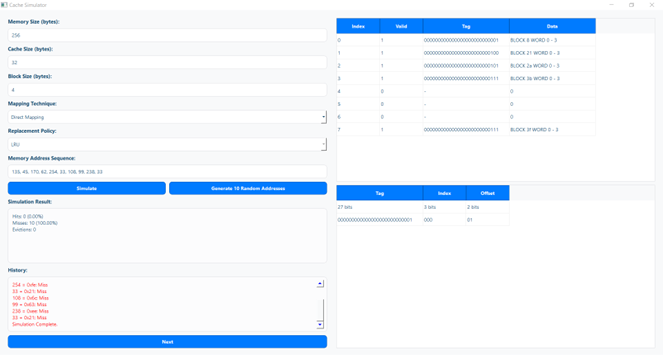
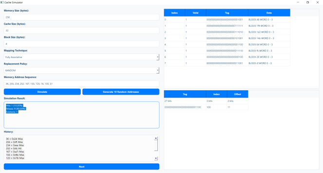
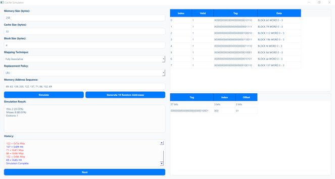

# Cache Memory Simulation

## Introduction

This project is a **Cache Memory Simulation** tool developed to visualize and interactively demonstrate the working of a cache memory system. The application provides insights into various cache memory operations such as placing new information (write), retrieving existing data (read), and handling cache evictions.

## Features

- **Graphical User Interface (GUI):** A user-friendly interface built with PyQt5.
- **Customizable Cache Configurations:**
  - Fully Associative Cache
  - Direct Mapped Cache
- **Replacement Policies:**
  - Least Recently Used (LRU)
  - First-In-First-Out (FIFO)
  - Most Recently Used (MRU)
  - Least Frequently Used (LFU)
  - Random Replacement
- **Performance Metrics:** The simulator calculates cache hit rate, miss rate, and replacement count.
- **Step-by-Step Execution:** Users can input memory addresses and visualize cache behavior in real-time.

## Application Interface

Below are snapshots of the **Cache Memory Simulation** interface showing different memory addresses inputted by the user:

### Interface Screenshots:

**1. Initial State of the Cache Simulation**  

**2. Cache Simulation with User Input**  

**3. Simulation Results Display**  

## Usage Instructions

1. **Set Cache Parameters:** Define memory size, cache size, block size, and mapping technique.
2. **Choose a Replacement Policy:** Select one of the available cache eviction methods.
3. **Input Memory Addresses:** Manually enter addresses or use the random generator.
4. **Run Simulation:** Observe how memory addresses map to cache locations.
5. **Analyze Performance Metrics:** View cache hits, misses, and evictions in real-time.

## Conclusion

The **Cache Memory Simulation** app is an educational tool designed to help students, educators, and developers understand how cache memory works. By simulating various configurations and policies, users can explore the impact of different strategies on system performance.

